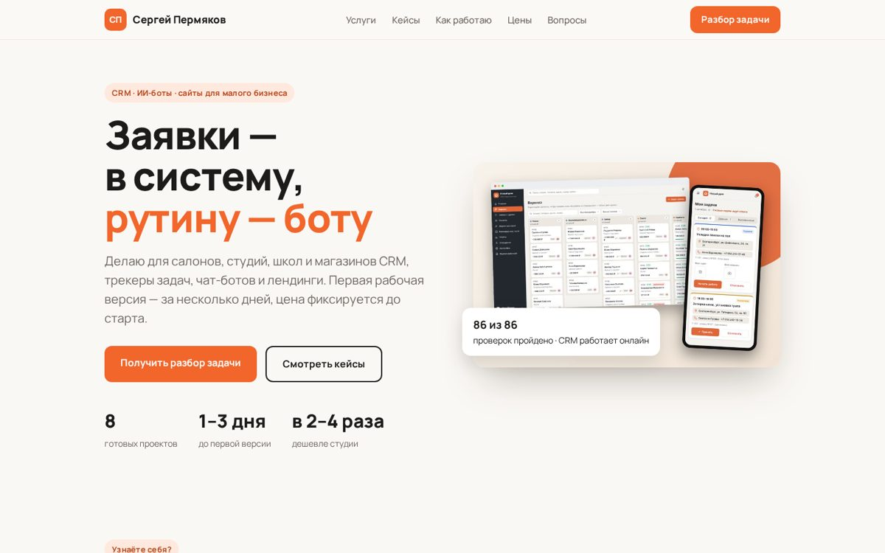

# Сайт-портфолио Сергея Пермякова

**Открыть:** https://permykov291281-sys.github.io/portfolio/

Одностраничный сайт фрилансера: CRM, ИИ-боты, лендинги и приложения для малого бизнеса.
Блоки: боли клиентов, услуги с ценами, 9 кейсов со ссылками на демо и код, «Обо мне», этапы работы,
пакеты «База» и «База+», частые вопросы, контакты.

**Стек:** HTML, CSS, немного JavaScript (фильтр кейсов), без фреймворков. Хостинг — GitHub Pages.
Сделан по ТЗ, полученному через ИИ-интервью. Разработка — вайб-кодинг в Claude Code.

